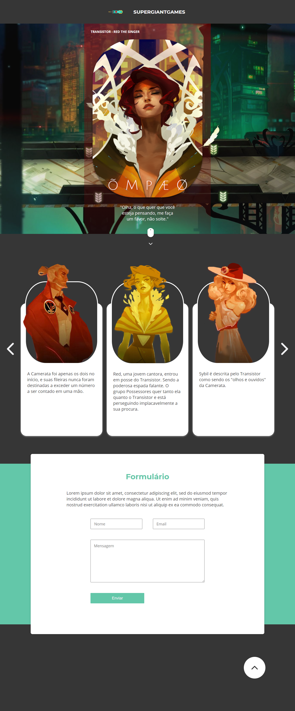

<div align="center">
  <h2>Transistor - Landing page</h2>
  <p>Projeto teste, desenvolvido com ReactJS.</p>
</div>

<br />

<h2>Rode na sua maquina</h2>

No terminal/prompt:
```sh
# clone este repositório
> git clone https://github.com/HigorDenomar/transistor-page

# vá para a pasta do projeto
> cd .\transistor-page\

#instale as dependência (requer o node.js instalado)
> npm install

# rode o projeto
> npm start
```
O site irá abrir em ``http://localhost:3000``

<h2>Layout</h2>
